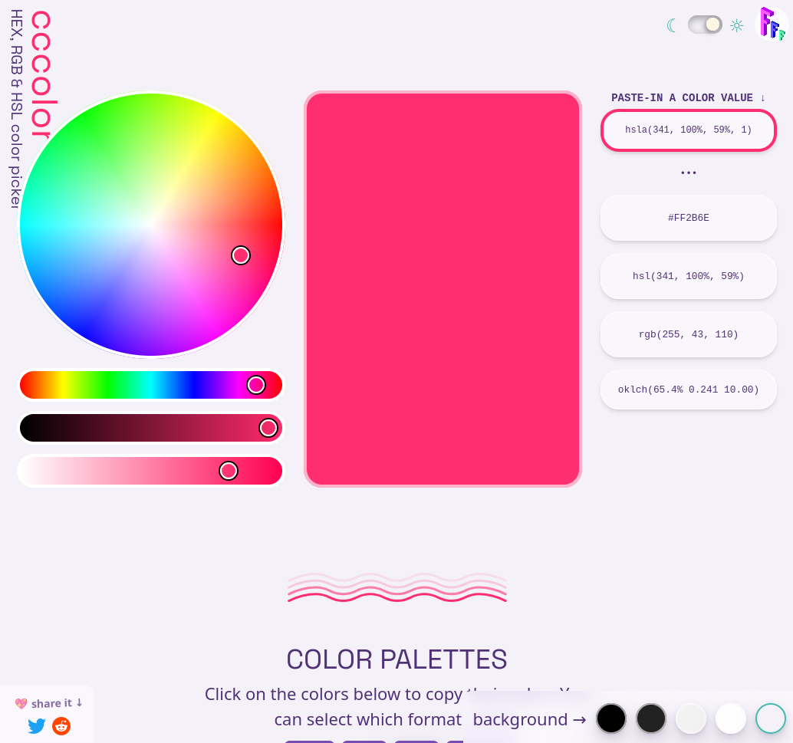
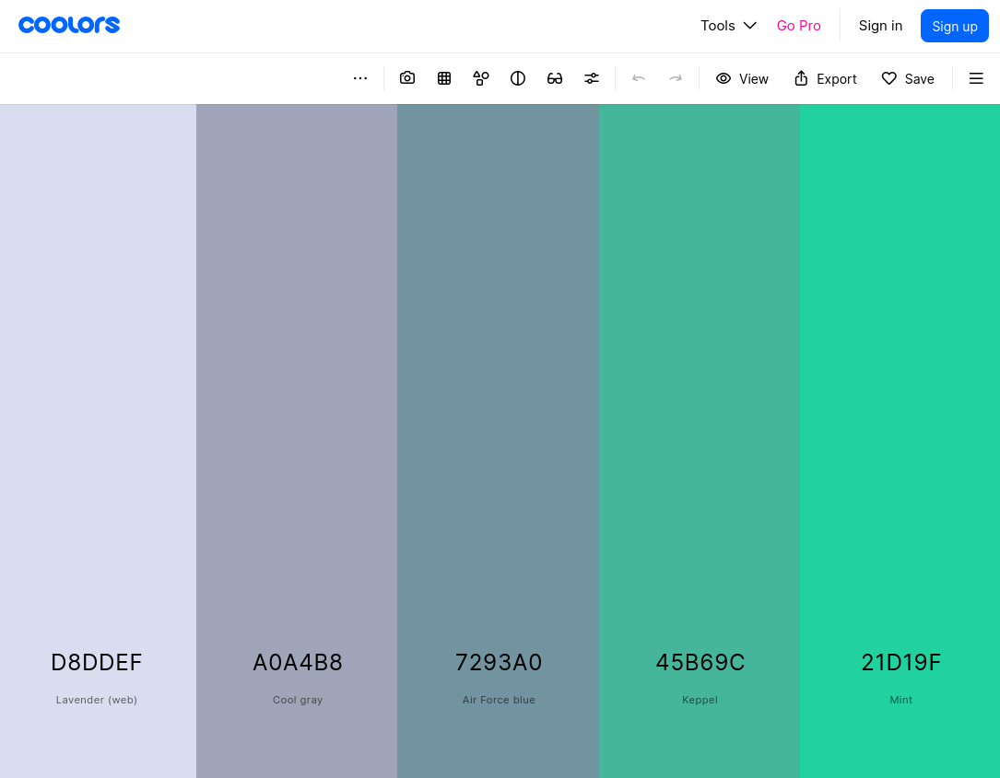
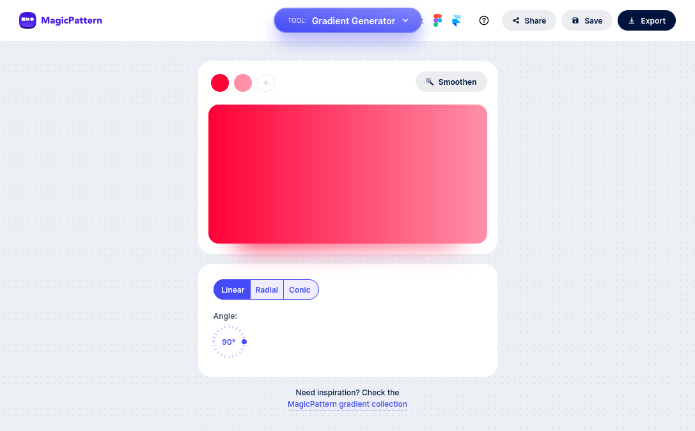
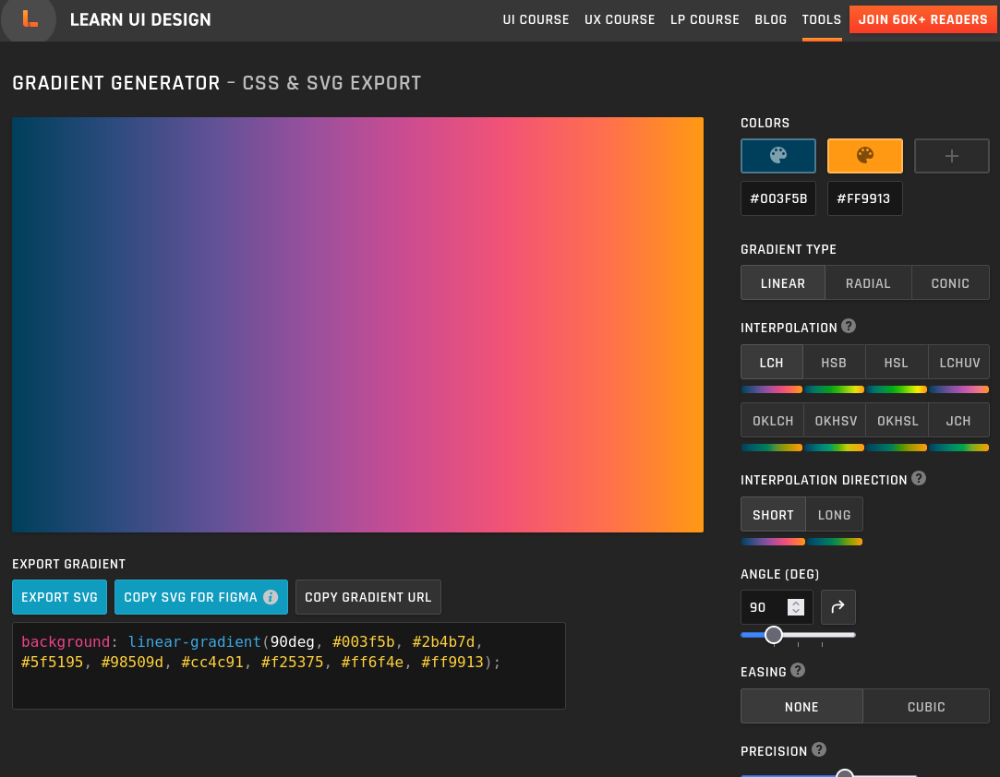
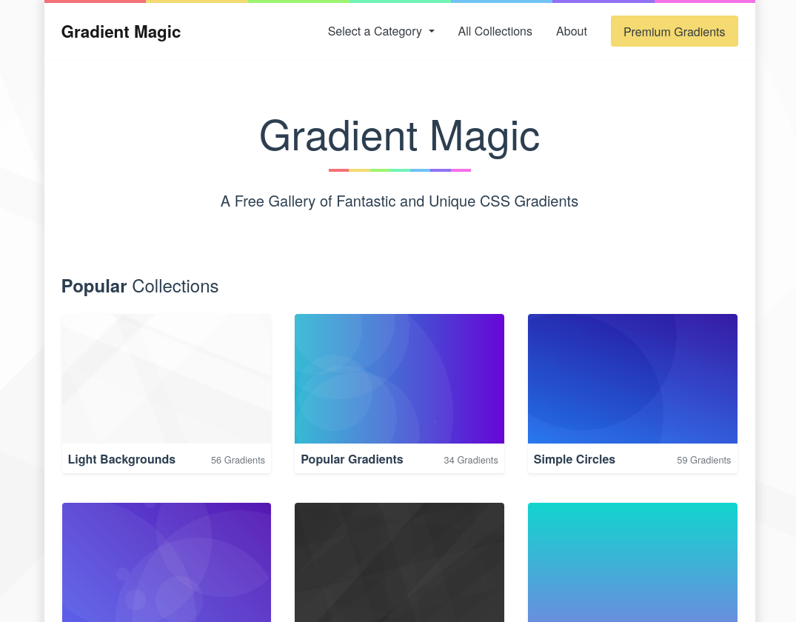
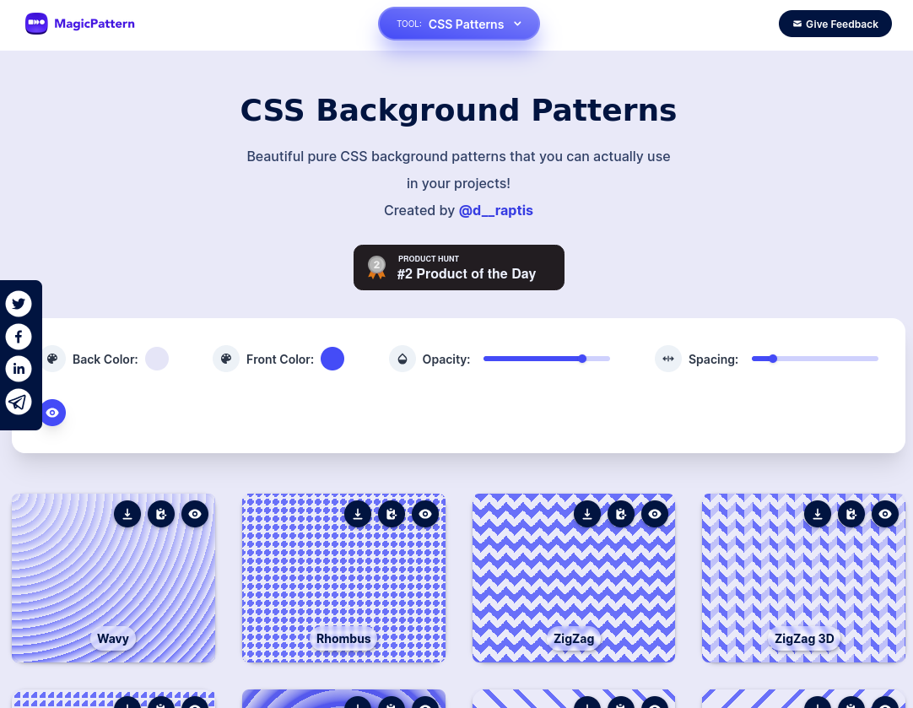
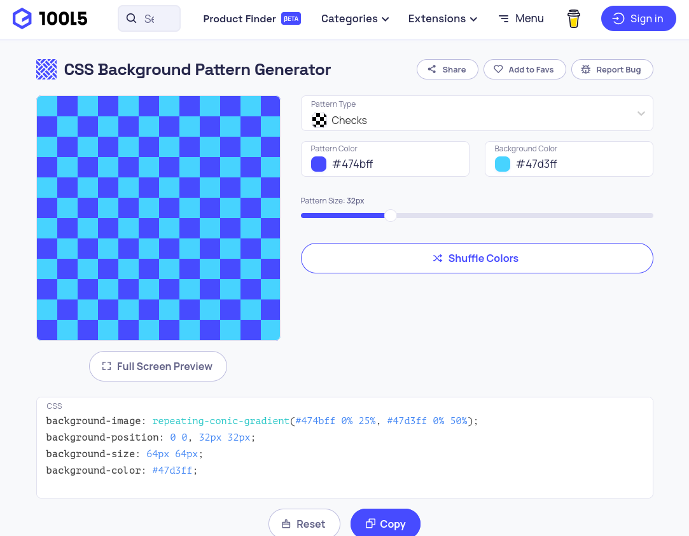
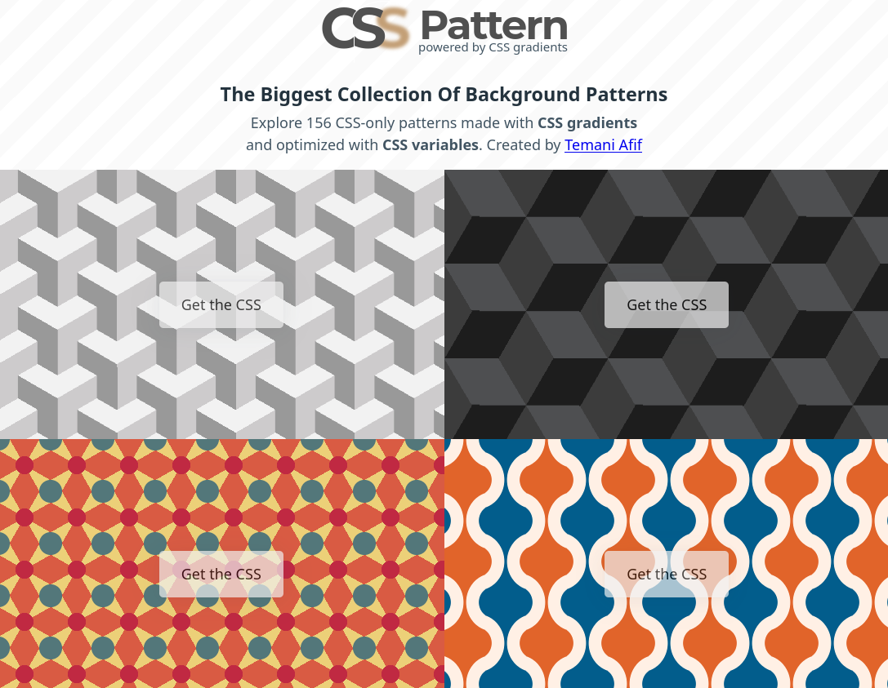
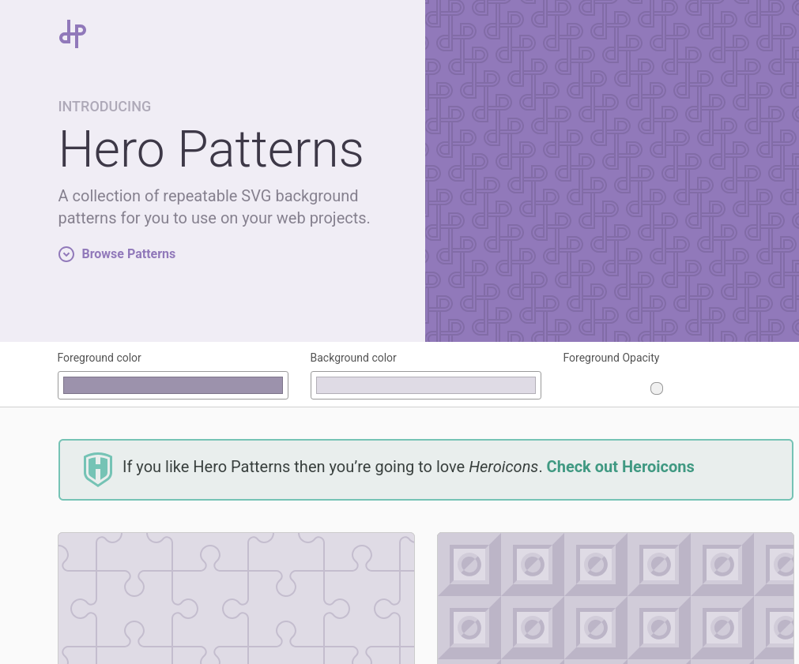

# Domina el Diseño en CSS: Tu Arsenal de Herramientas para Colores, Degradados y Patrones (Parte 1)

Como desarrolladores, a menudo nos enfrentamos a un desafío común: dedicar más tiempo del deseado a tareas de diseño. Lo que empieza como una simple elección de colores puede convertirse en horas de ajustes, desenfocándonos de lo que realmente importa: la funcionalidad y el avance del proyecto.

Para evitar que esto te ocurra, he preparado una serie de artículos con herramientas que agilizarán tu flujo de trabajo en CSS. En esta primera entrega, nos enfocaremos en recursos relacionados al color, los gradientes y los patrones. ¡Empecemos!

## Colores
Estás por empezar un proyecto y quieres que tenga un diseño visualmente impactante. Necesitas inspiración, pero también rapidez para tomar la decisión. Aquí tienes 2 herramientas que se convertirán en tus mejores aliadas.

### Fffuel - Cccolor

A simple vista, este es un selector de color como cualquier otro, pero si indagamos un poco más en su interfaz nos encontraremos varias características que lo hacen único.

- Al seleccionar el color, puedes obtener su código en múltiples formatos (RGB, Hex, HSL, etc.).
- Ofrece varias paletas de colores armónicas basadas en la selección principal. 
- Podemos cambiar el fondo de la web para hacer una verificación precisa contrastes en tiempo real.
- Incluye una explicación brillante y concisa sobre teoría del color. Para mí, esta es su característica estrella.

**Link:**
https://www.fffuel.co/cccolor/
### Coolors

Esta es la herramienta definitiva para generar paletas de colores de forma rápida y creativa. Sólo empieza pulsando la barra espaciadora y deja que la magia ocurra.
- Si te ha gustado un color, puedes bloquearlo pulsando el ícono del candado, al pulsar la barra espaciadora de nuevo, el resto de colores se generarán en armonía con tu selección.
- Al hacer clic en el valor hexadecimal del color, puedes acceder a 3 controles deslizantes (sliders) que te permitirán dar un ajuste fino al tono que quieres. Adicionalmente tendrás la opción de visualizar el valor del color en diferentes códigos.
- Puedes subir una imagen para extraer la paleta de colores de esta de forma automática.
- Tiene ajustes globales que te permitirán cambiar la saturación o la temperatura de la paleta.
- Además de poder copiar el código de los colores de la paleta, existe una función que te permitirá compartir la URL de esta, para que otra persona pueda visualizar y ajustar los colores.
- Puedes registrarte para poder guardar tus paletas de colores y poder acceder a ellas desde cualquier dispositivo.

**Link:**
https://coolors.co/

## Gradientes
Los degradados bien ejecutados pueden transformar un diseño plano en algo vibrante y moderno. Aquí van tres generadores, cada uno con un enfoque diferente.
### MagicPattern Gradient Generator

Empecemos con una herramienta sencilla y que va al grano. Este es un generador de gradientes con una interfaz muy amigable. Entre sus características encontramos:

- Tiene 3 tipos de gradientes: Lineal, radial y cónico.
- Podemos añadir cuantos colores deseemos en nuestro gradiente dependiendo del grado de complejidad que queramos.
- Para cada color que escojamos, tenemos sliders para el tinte y la transparencia.
- Obtendremos el valor del color en RGBA si queremos usarlo en otro lado, y también tenemos disponible la herramienta del cuentagotas para extraer el color desde una imagen.
- Entre las opciones de exportación, tenemos imágenes PNG, JPEG o SVG, pudiendo controlar la calidad, y el tamaño. Adicionalmente tenemos un botón que nos permitirá copiar el código CSS del gradiente.

**Link:**
https://www.magicpattern.design/tools/gradient-generator

### Learn UI Design - Gradient Generator

Aquí nos encontramos con una algo más avanzado y más flexible que nos permitirá tener más control sobre el degradado que queremos hacer, así como una galería de gradientes que podemos usar de punto de partida para modificar a nuestro gusto. Veamos sus características más destacables:
- Tenemos un selector de colores que nos permite hacer hasta 3 selecciones.
- Contamos con 3 tipos de gradientes: Lineal, radial y cónico.
- Hay un panel "interpolation" que nos permitirá ajustar qué tan suave se verá nuestro resultado, con una pequeña previsualización debajo de cada botón de selección.
- Podemos configurar la dirección de la interpolación para más control.
- Tenemos disponible un campo numérico que nos permitirá ajustar el ángulo del degradado, además de botones y sliders para ajustar la precisión y la suavidad del degradado.
- Contamos con una previsualización en tiempo real del código CSS correspondiente al degradado que estamos creando.
- Entre las opciones de exportación, tenemos disponible el formato SVG, la capacidad de copiar el SVG para usarlo en Figma, o podemos copiar la URL del degradado para compartirla con alguien que quiera realizar algún ajuste adicional posterior.
- En la parte inferior podemos encontrar algo de texto explicativo sobre el uso de la herramienta y sobre la creación de degradados en general.

**Link:**
https://www.learnui.design/tools/gradient-generator.html

### Gradient Magic

Esta, más que una herramienta para la creación de gradiente, es una biblioteca de inspiración que podemos usar en nuestros proyectos. Tiene un amplio catálogo de gradientes listos para su uso. Veamos algunas de sus características:
- Podemos buscar entre más de 1500 tipos de gradientes.
- Si alguno nos gusta, podemos modificar algunos parámetros básicos como los colores, y su rotación.
- Entre las opciones de exportación, tenemos disponible la copia del código CSS, o la capacidad de exportar una imagen en una resolución de nuestro agrado (Esta opción es premium).

**Link:**
https://www.gradientmagic.com/

## Patrones
Para cerrar con esta primera parte de la serie de herramientas de CSS, veremos algunas herramientas para la generación de patrones. Estos los podemos usar como background de nuestros proyectos web. ¡Es mucho más optimo crearlos en CSS que poner una imagen!

### MagicPattern CSS Background Patterns

Aquí nos encontramos con una herramienta que, al abrirla, nos mostrará una galería de patrones disponibles con algunas herramientas que nos permitirán cambiar algunos parámetros de estos. Veamos:
- Podemos cambiar el back color y el front color de estos, obteniendo previsualización en tiempo real de los cambios.
- Tenemos dos sliders disponibles que nos permitirán ajustar la opacidad y el espaciado.
- Cada patrón en la galería tiene 3 botones en la parte superior que nos permitirán exportarlo como imagen, copiar el código CSS, u obtener una previsualización del patrón aplicándolo en el fondo de la aplicación web.

**Link:**
https://www.magicpattern.design/tools/css-backgrounds

### 10015.io - CSS Background Pattern Generator

Esta es una aplicación más condensada pero igual de poderosa. Veamos qué puede hacer:
- Tenemos una lista desplegable para seleccionar el tipo de patrón que queremos crear.
- Podemos cambiar el color del patrón desde un selector.
- Tenemos la capacidad de ajustar el tamaño del patrón desde un slider.
- En la parte inferior tenemos el código CSS del patrón actualizado en tiempo real.

**Link:**
https://10015.io/tools/css-background-pattern-generator

### CSS Pattern

Esta es una galería de más de 150 patrones listos para usar en CSS. Hay infinidad de diseños, formas y colores. Es un recurso muy valioso. Al seleccionar algún patrón tendremos la posibilidad de modificar algunos de sus parámetros, como los colores y el tamaño. Adicionalmente, podremos copiar su código CSS con un solo clic. ¡Mi favorita!

**Link:**
https://css-pattern.com/

### Bonus - Hero Patterns

Como extra, te presento esta joya. Hero Patterns ofrece una colección de patrones SVG repetibles, sutiles y muy elegantes, ideales para fondos que no deben robar el protagonismo. Nos ofrece diseños modernos y atractivos a la vista. Podemos configurar sus colores y su opacidad y podremos ver y copiar el código CSS generado.

**Link:**
https://heropatterns.com/

Y con esto cerramos la primera parte de nuestro recorrido por las mejores herramientas de CSS. Como has visto, existe un verdadero arsenal de recursos gratuitos que pueden no solo embellecer nuestros proyectos, sino también hacernos desarrolladores más eficientes. La clave está en saber qué herramienta usar para cada tarea.

Te podría interesar cuáles son las [5 mejores extensiones de VSCode](https://jvdevsolutions.com/5-mejores-extensiones-vscode) que todo desarrollador debería usar en 2025. 

Por ahora, me encantaría saber tu opinión. ¿Cuál de estas herramientas te ha parecido más interesante o vas a probar en tu próximo proyecto? ¿Tienes alguna otra favorita que no esté en la lista? ¡Te leo en los comentarios!
