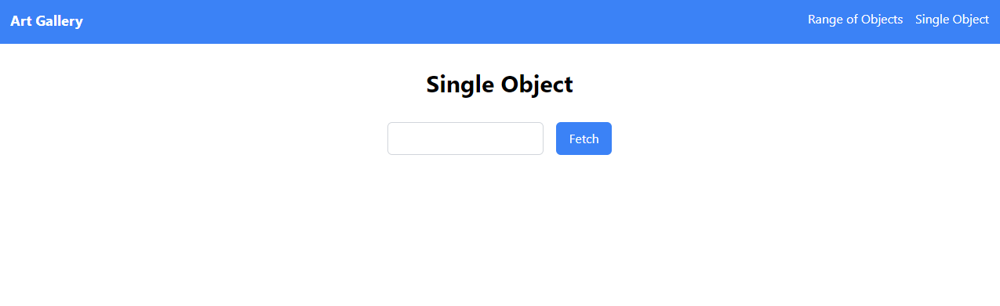
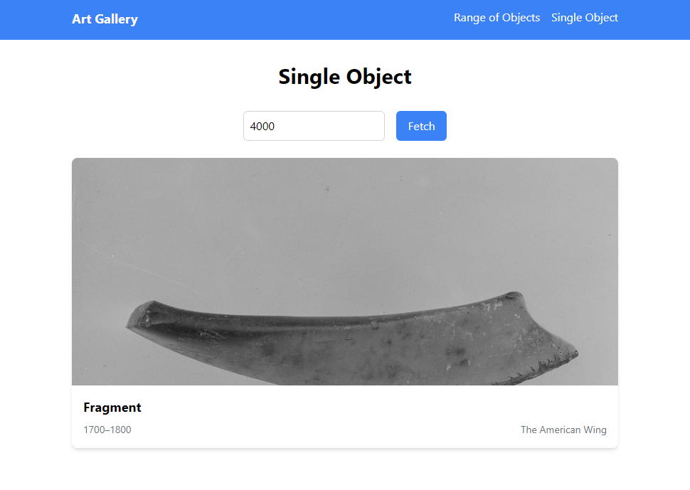
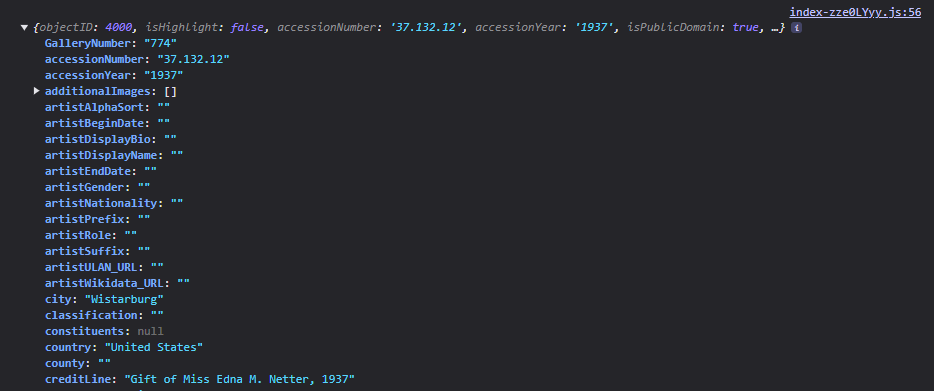
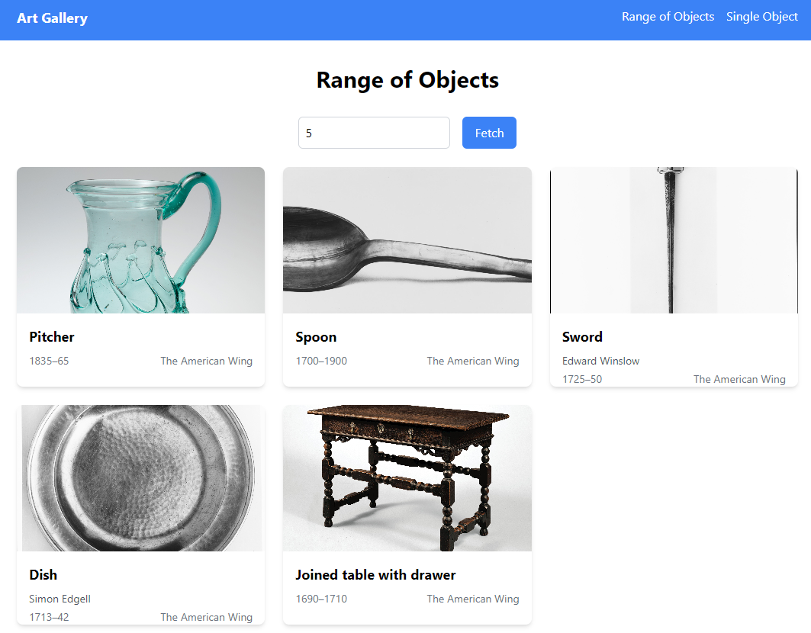

Axios is a popular JavaScript library used to make HTTP requests from web applications. It enables seamless communication between your app and a server, such as retrieving data from an API or sending data to an external service. In this guide, we’ll explore how to use Axios for GET requests in a React application.

## Why Choose Axios?

While there are many libraries available for making HTTP requests, Axios stands out for several reasons:

1. **Ease of Use**: Axios has a straightforward syntax that makes your code easy to write and read.
2. **Promise-Based**: It supports `.then()` and `.catch()` for handling responses or `async/await` for improved readability.
3. **Versatility**: Axios works in both browsers and Node.js, making it suitable for frontend and backend development.
4. **Extra Features**: Axios comes with handy functionalities like:
   - Automatic JSON response handling.
   - Easy configuration of headers.
   - Request cancellation.
   - Built-in error handling.

Let’s dive into a practical example to understand how to make GET requests with Axios in React.

---

## Setting Up the Project

To follow along, clone the project repository from GitHub and switch to the `initial-config` branch:

[GitHub Repository - Axios React Guide](https://github.com/jaimevillegas/axios-react-guide/tree/initial-config)

### Steps:

1. Clone the repository and open it in your favorite code editor.

2. Run the following command in your terminal to install dependencies:

   ```bash
   npm install
   ```

3. Start the development server with:

   ```bash
   npm run dev
   ```

You should see a URL in the terminal to access the project in your browser. The current app only displays basic components without functionality, which we will add.



If you try entering a number in the text field, you’ll notice that nothing happens. The existing code in the project only renders the components. Our goal will be to implement the necessary functions to fetch data from the Metropolitan Museum of Art.

---

## Understanding the Project Structure

 

The project includes several files, but for this tutorial, we’ll focus on `artService.js`. This file will contain the functions required to fetch data from the Metropolitan Museum of Art API.

### API Endpoint

The API documentation is available [here](https://metmuseum.github.io/). To fetch a specific object, we’ll use the following endpoint:

```bash
GET /public/collection/v1/objects/[objectID]
```

### Implementing a GET Request

Open `artService.js` and add the following code:

```javascript
import axios from 'axios';

const BASE_URL = 'https://collectionapi.metmuseum.org/public/collection/v1';

export const artService = {
  async getArtworkByNumber(number) {
    try {
      const response = await axios.get(`${BASE_URL}/objects/${number}`);
      return response.data;
    } catch (error) {
      console.error(`Error fetching artwork with number ${number}:`, error);
      return null;
    }
  },
};
```

#### Explanation:


- **Axios GET**: The `axios.get` method makes a GET request to the API. We construct the URL dynamically using the `number` parameter.
- **Async/Await**: The request is asynchronous, allowing the app to remain responsive while waiting for the response.
- **Error Handling**: Errors are caught and logged to the console, and `null` is returned for failed requests.

This basic Axios implementation allows us to make a GET request to an API, retrieve response data, and handle errors if necessary.

With this method ready, we can test the application to verify that we can fetch an object. By entering a number between 1 and 10,000 in the input field, the app will display a card with the retrieved data.




---

## Debugging API Responses

To better understand the API’s responses, we can add a `console.log()` statement before returning the data:

```
console.log(response.data);
return response.data;
```

Console logging is an essential tool in a typical workflow as it helps debug and inspect API responses before integrating them into your application.



If you want to see how this data is rendered in the web app, take a look at the `SinglePage.jsx` component:

```javascript
import { artService } from '../services/artService';

...

  const fetchArtwork = async () => {
    try {
      setLoading(true);
      setError(null);
      const data = await artService.getArtworkByNumber(objectNumber);
      setArtwork(data);
    } catch (err) {
      setError('Failed to fetch artwork. Please try again later.');
      console.error('Error:', err);
    } finally {
      setLoading(false);
    }
  };
```

This asynchronous function in `SinglePage.jsx` calls the `getArtworkByNumber` method, assigning the response to a state variable for rendering on the screen.

---

## Fetching Multiple Objects

Now, let’s extend the functionality to fetch multiple objects:

```javascript
async fetchMultipleArtworks(numberOfObjects) {
  const artworks = [];
  const min = 1;
  const max = 10000;
  const randomNumbers = new Set();

  while (randomNumbers.size < numberOfObjects) {
    const randomNum = Math.floor(Math.random() * (max - min + 1)) + min;
    randomNumbers.add(randomNum);
  }

  for (const num of randomNumbers) {
    const artwork = await this.getArtworkByNumber(num);
    if (artwork) {
      artworks.push(artwork);
    }
  }

  return artworks;
}
```

### Explanation:

- **Random Numbers**: We generate unique random numbers within a specified range to fetch random artworks.
- **Sequential Fetching**: Each random number is used to fetch data from the API using `getArtworkByNumber`.
- **Data Collection**: Valid responses are added to the `artworks` array.

This method takes a numeric parameter, `numberOfObjects`. It initializes variables to store fetched artworks, defines the range for random numbers, and ensures uniqueness with a `Set`. Each random number is used to fetch data, populating the `artworks` array, which is then returned for rendering in the app.



Here’s how the objects are displayed in the `RangePage.jsx` component:

```javascript
  import { artService } from '../services/artService';
 
 ...
  
  const fetchArtworks = async () => {
    try {
      setLoading(true);
      setError(null);
      const data = await artService.fetchMultipleArtworks(numberOfObjects);
      setArtworks(data);
    } catch (err) {
      setError('Failed to fetch artworks. Please try again later.');
      console.error('Error:', err);
    } finally {
      setLoading(false);
    }
  };
```

The `fetchArtworks` function calls `fetchMultipleArtworks`, assigning the response to a state variable that the app renders below.

---

## Wrapping Up
The `artService.js` file now contains the complete functionality for fetching data:

```javascript
import axios from 'axios';

const BASE_URL = 'https://collectionapi.metmuseum.org/public/collection/v1';

export const artService = {
  async getArtworkByNumber(number) {
    try {
      const response = await axios.get(`${BASE_URL}/objects/${number}`);
      return response.data;
    } catch (error) {
      console.error(`Error fetching artwork with number ${number}:`, error);
      return null;
    }
  },

  async fetchMultipleArtworks(numberOfObjects) {
    const artworks = [];
    const min = 1;
    const max = 10000;
    const randomNumbers = new Set();

    while (randomNumbers.size < numberOfObjects) {
      const randomNum = Math.floor(Math.random() * (max - min + 1)) + min;
      randomNumbers.add(randomNum);
    }

    for (const num of randomNumbers) {
      const artwork = await this.getArtworkByNumber(num);
      if (artwork) {
        artworks.push(artwork);
      }
    }

    return artworks;
  },
};
```
This implementation offers a clear and functional approach to fetching single or multiple data entries, with robust error handling and reusable code.
## Conclusion

This guide demonstrated how to use Axios to make GET requests in a React application. You learned to:

1. Set up Axios to fetch data from an API.
2. Handle errors gracefully.
3. Extend functionality to retrieve multiple objects.

In the next part of this series, we’ll explore how to handle POST requests and more advanced features of Axios.

[Try the completed application here](https://axios-react-guide.netlify.app/)

After exploring how to consume APIs in React, covering component lifecycle, best practices for error handling, and performance optimization, an interesting question arises: **What challenges have you faced when working with APIs in your React projects?**

This is a great opportunity to reflect on your own experiences and learn from others. Share your thoughts or questions in the comments, and let’s continue growing together as developers!
